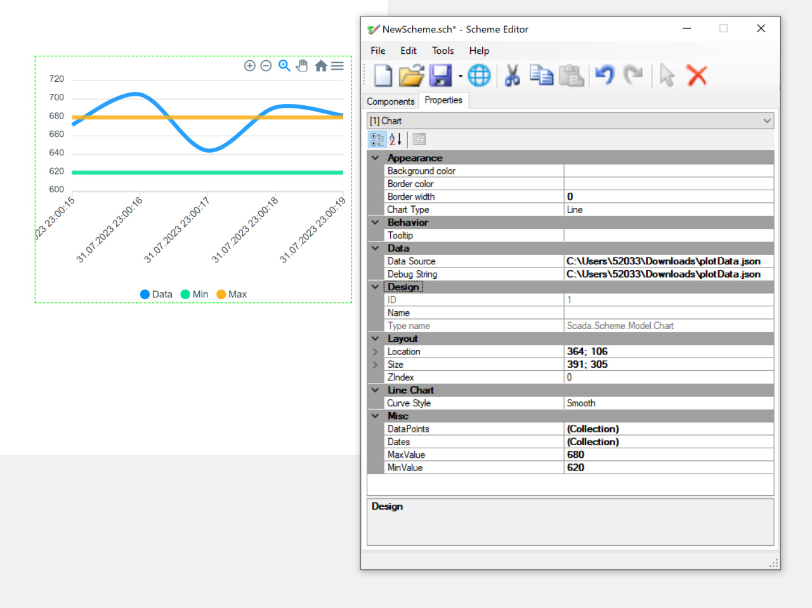
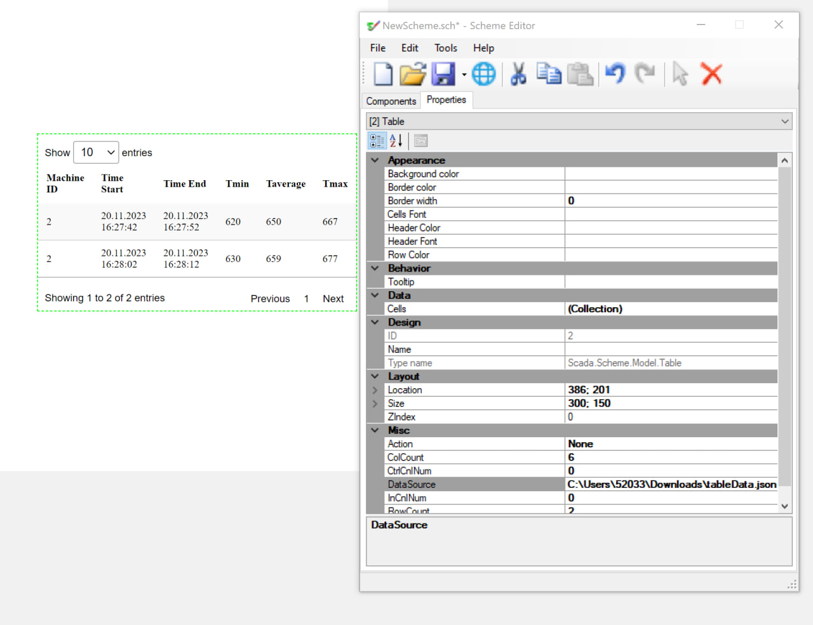

#Scada-Module

Additional module for Rapid SCADA(https://github.com/RapidScada/scada) with custom tables and charts.

##Setup 

Instructions on how to run the project on your local machine...

### Requirements

1.Visual Studio 22 community
2.Build tools 2019 with .NET desktop build tools(.NET Framework 4-4.6 dev tools)

### Installation

git clone https://github.com/NikitaKalabin/Scada-Module

### Running the SchemeEditor

Open ScadeScheme.sln, build and run project in realease

## Implementation Details

###1.Chart class

####Features

- A lot of charts types, read more in https://apexcharts.com/docs/chart-types/line-chart/
- Parse from json
- Full color customization

###2.Table class

####Features

- Tables with DataTables js library
- Parse from json
- Cells editing

## Made By 

- [@NikitaKalabin](https://github.com/NikitaKalabin)
- [@Danila Alkhovik](https://github.com/Alkogolek228)
- [@TyomaVader](https://github.com/TyomaVader)